<div align="center">

# MinecraftImageGenerator

**A Java library for programmatically generating Minecraft-themed images:** item tooltips, inventories, individual items, and player heads, as static PNGs or animated GIFs.

[](https://jitpack.io/#Aerhhh/MinecraftImageGenerator)


<br>

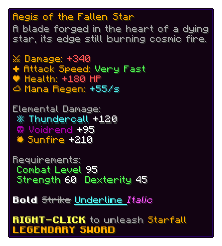
&nbsp;&nbsp;
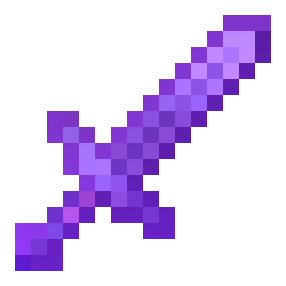
&nbsp;&nbsp;
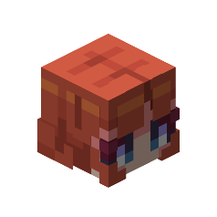

</div>

Everything below was rendered by the library itself. Each snippet is the actual code that produces the image next to it.

## Showcase

### Item tooltips

Full Minecraft formatting: colors, bold, italic, strikethrough, underline, obfuscation, text wrapping, rarity coloring, and configurable padding and borders.

<div align="center">

</div>

```java
GeneratedObject tooltip = new GeneratorImageBuilder()
    .addGenerator(new MinecraftTooltipGenerator.Builder()
        .withName("Aegis of the Fallen Star")
        .withRarity(Rarity.byName("LEGENDARY"))
        .withType("SWORD")
        .withItemLore("""
            &7A blade forged in the heart of a dying star.

            &6⚔ Damage: &c+340
            &6✦ Attack Speed: &aVery Fast

            &f&lBold &7&mStrike&r &b&nUnderline &d&oItalic

            &e&lRIGHT-CLICK &7to unleash &6Starfall""")
        .withMaxLineLength(48)
        .withRenderBorder(true)
        .build())
    .build();
```

### Gradient and hex color text

Use `%%gradient:#start:#end%%...%%/gradient%%` for smooth per-character gradients, and `&#RRGGBB` for inline hex colors.

<div align="center">
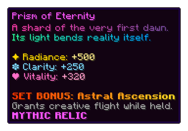
</div>

```java
new MinecraftTooltipGenerator.Builder()
    .withName("Prism of Eternity")
    .withRarity(Rarity.byName("MYTHIC"))
    .withType("RELIC")
    .withItemLore("""
        %%gradient:#ff3cac:#784ba0%%A shard of the very first dawn.%%/gradient%%
        %%gradient:#2af598:#009efd%%Its light bends reality itself.%%/gradient%%

        &#ffd700✦ Radiance: &#ffec8b+500
        &#7fdbff❉ Clarity: &#7fdbff+250""")
    .withRenderBorder(true)
    .build();
```

### Alternate fonts

Render text in the Standard Galactic Alphabet (`&g`) or Illageralt (`&h`).

<div align="center">
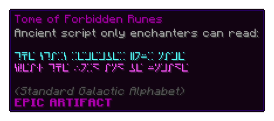
</div>

```java
new MinecraftTooltipGenerator.Builder()
    .withName("Tome of Forbidden Runes")
    .withRarity(Rarity.byName("EPIC"))
    .withType("ARTIFACT")
    .withItemLore("&b&gThe stars remember your name\n&d&gSpeak the word and be unmade")
    .build();
```

### Items and enchantment glint

Render any vanilla item from its id, optionally with an animated enchantment glint. When a generator is animated, `getGifData()` returns the encoded GIF.

<div align="center">
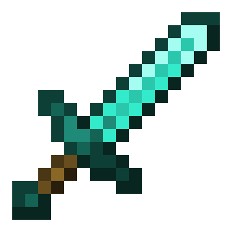
&nbsp;&nbsp;&nbsp;&nbsp;

</div>

```java
// Static item
new MinecraftItemGenerator.Builder()
    .withItem("diamond_sword")
    .isBigImage()
    .build();

// Animated enchant glint
GeneratedObject glint = new GeneratorImageBuilder()
    .addGenerator(new MinecraftItemGenerator.Builder()
        .withItem("netherite_sword")
        .isEnchanted(true)
        .isBigImage()
        .build())
    .build();

Files.write(Path.of("glint.gif"), glint.getGifData());
```

### Inventories

Complete inventory grids with item placement, stack counts, titles, and configurable rows and columns. The inventory string is `material:slot` per item (`{slot:amount}` sets a stack count), joined with `%%`.

<div align="center">
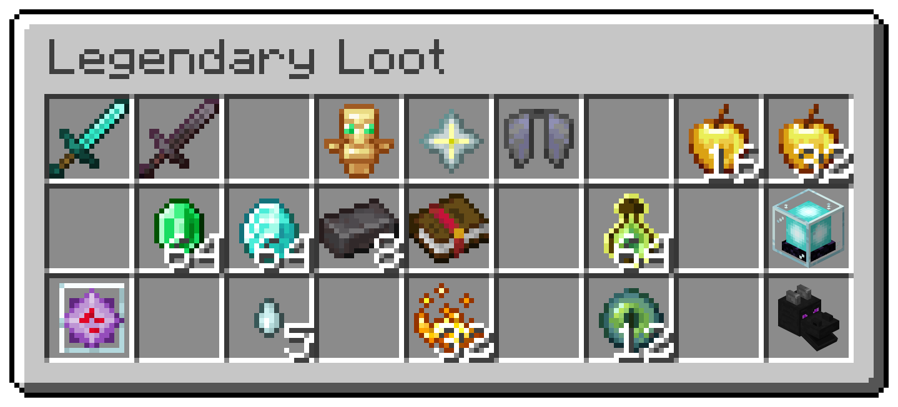
</div>

```java
new MinecraftInventoryGenerator.Builder()
    .withRows(3)
    .withSlotsPerRow(9)
    .withContainerTitle("Legendary Loot")
    .withInventoryString(
        "diamond_sword:1%%nether_star:5%%elytra:6%%"
        + "emerald:{11:64}%%diamond:{12:64}%%dragon_head:27")
    .build();
```

### Player heads

Render a 3D player head from a player name, texture URL, base64 texture data, or a texture hash.

<div align="center">

</div>

```java
new MinecraftPlayerHeadGenerator.Builder()
    .withSkin("Aerh") // name, texture URL, base64, or hash
    .withScale(-2)    // positive upscales, negative downscales
    .build();
```

## Quick start

Compose one or more generators with `GeneratorImageBuilder` and write the result to disk. Static output is a `BufferedImage`, and animated output is a GIF byte array.

```java
GeneratedObject result = new GeneratorImageBuilder()
    .addGenerator(new MinecraftTooltipGenerator.Builder()
        .withName("Hello World")
        .withRarity(Rarity.byName("RARE"))
        .withItemLore("&7Your first &brendered &7tooltip.")
        .build())
    .build();

if (result.isAnimated()) {
    Files.write(Path.of("output.gif"), result.getGifData());
} else {
    ImageIO.write(result.getImage(), "png", new File("output.png"));
}
```

## Resource pack support

By default everything renders with vanilla textures. You can also load a resource pack and render any generator with its item textures, tooltip styles, custom glyphs, and color palette. This is what drives Hypixel SkyBlock item rendering, for example.

Register a pack, from a directory or a zip, then pass its id to any generator:

```java
// Load a pack from disk (directory or .zip). Stays registered until unregistered.
PackId skyblock = PackRepository.global().register(
    "hypixel:skyblock",
    PackSource.directory(Path.of("packs/hypixel-skyblock"), PackLimits.fromSystemProperties()));

// A tooltip in one of the pack's rarity styles, with a gradient and hex colors
new MinecraftTooltipGenerator.Builder()
    .withName("&#c77dffMaelstrom")
    .withRarity(Rarity.byName("MYTHIC"))
    .withType("STAFF")
    .withItemLore("""
        %%gradient:#f857a6:#ff5858%%The sky answers only to its bearer.%%/gradient%%

        &7Intelligence: &b+900
        &7Ability Damage: &d+65%""")
    .withPack("hypixel:skyblock")
    .withTooltipStyle("hypixel_skyblock:mythic")
    .build();

// A custom item texture from the pack
new MinecraftItemGenerator.Builder()
    .withItem("hypixel_skyblock:item/uncategorized/aurora_staff")
    .withPack("hypixel:skyblock")
    .isBigImage()
    .build();
```

The items below are invented, rendered with this pack's real textures and rarity tooltip styles (`common` through `mythic`, plus `special`, `supreme`, `ultimate`, and more):

<table>
<tr>
<td align="center" width="50%">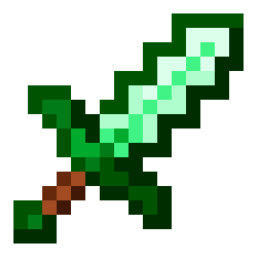<br>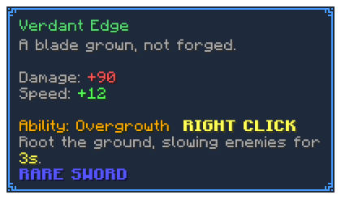</td>
<td align="center" width="50%">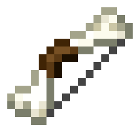<br>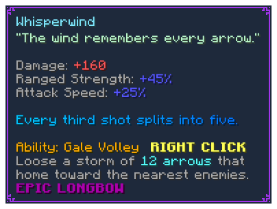</td>
</tr>
<tr>
<td align="center">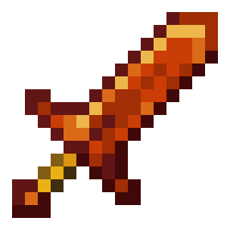<br>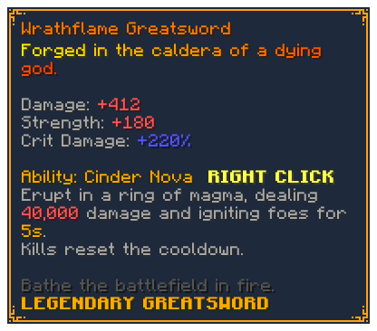</td>
<td align="center">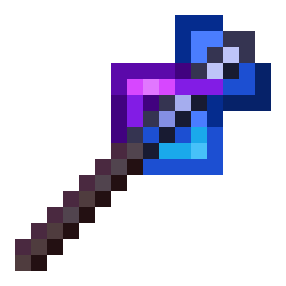<br>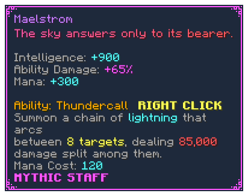</td>
</tr>
<tr>
<td align="center">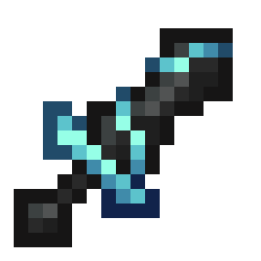<br>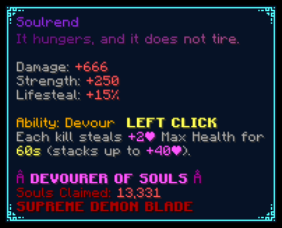</td>
<td align="center">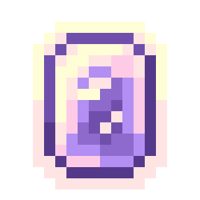<br>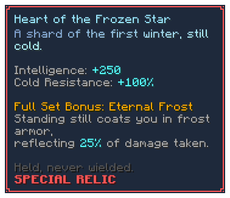</td>
</tr>
<tr>
<td align="center">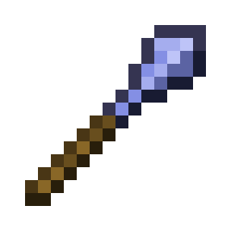<br>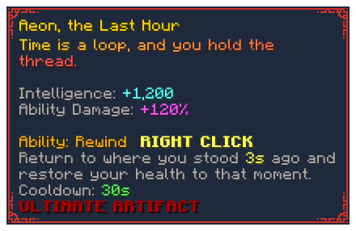</td>
<td align="center"></td>
</tr>
</table>

- Vanilla (`minecraft:minecraft`) is always available and is the default, so `withPack` is opt-in.
- Pack ids are `namespace:name` at the library level (e.g. `hypixel:skyblock`), separate from the asset namespace a pack declares internally (e.g. `hypixel_skyblock`).
- Item refs use the pack's asset namespace and item path (e.g. `hypixel_skyblock:item/uncategorized/aurora_staff`).
- `withTooltipStyle(...)` selects the pack's `minecraft:tooltip_style` (e.g. `hypixel_skyblock:mythic`).
- The item and inventory generators accept `withPack(...)` too, so a whole inventory can render in a pack's style.
- `PackRepository.global().unregister("hypixel:skyblock")` releases a pack and frees its id. There is no atomic replace: to swap a pack's content under the same id, unregister it and register again - a render racing the swap fails with the ordinary pack-not-registered error until the new registration lands.

## Server pack support

Beyond item textures and tooltip styles, the library renders the interface techniques that large server resource packs are built on: menus whose entire background is glyph art drawn by the title through a custom font, per-rarity tooltip frames, elements-based item models dispatched on custom model data, and HUD text pushed through bossbar names. Packs like these ship on many large servers; every example below uses a fictional pack (`emberveil`) - swap in your own pack's ids.

### Loading large packs

Pack reads are guarded by `PackLimits`. The defaults (read from `generator.pack.*` system properties) comfortably fit vanilla-scale packs, but large server packs can far exceed the 20,000-entry default. Construct one `PackLimits` and pass the **same instance** to both the source factory and `register` so read-time and index-time limits agree:

```java
PackLimits limits = new PackLimits(
    60_000,               // maxEntries
    8L * 1024 * 1024,     // maxEntryBytes
    1_024,                // maxTextureDim (item and general GUI textures)
    256L * 1024 * 1024,   // textureCacheMaxBytes
    8_192);               // sheetTextureMaxDim (font glyph sheets, sprite strips)

PackId emberveil = PackRepository.global().register(
    "emberveil:main",
    PackSource.zip(Path.of("packs/emberveil.zip"), limits),
    limits);
```

- What `maxEntries` counts depends on the source type: a zip counts every central-directory record (regular files *and* directory entries), a directory source counts only regular files under `assets/`. Size the limit comfortably above the pack's record count.
- Sheet-shaped textures (font glyph sheets, animated tooltip sprite strips) decode under the separate `sheetTextureMaxDim` cap (default 8192); item and general GUI textures keep the strict `maxTextureDim` image-bomb guard.

### Pack fonts in text

Each text segment resolves against a font id: its explicit pack font id when set, otherwise the resource location of its built-in font (`minecraft:default` for ordinary text, `minecraft:alt` for `&g`, `minecraft:illageralt` for `&h`). A pack that overrides `minecraft:default` therefore restyles ordinary tooltip text automatically - just render with `withPack(...)`:

```java
// The pack's minecraft:default override restyles all of this text
new MinecraftTooltipGenerator.Builder()
    .withName("Emberveil Compass")
    .withRarity(Rarity.byName("RARE"))
    .withItemLore("&7Points to the nearest ember rift.")
    .withPack("emberveil:main")
    .build();
```

Explicit font ids go on individual runs and segments: the `font` key of a menu recipe title run, `TitleRun.of(text, fontId)` for container titles and HUD lines, and `withPackFontId(...)` when composing a `MinecraftTooltip` from segments directly:

```java
MinecraftTooltip tooltip = MinecraftTooltip.builder()
    .withSegments(ColorSegment.builder()
        .withText("\uE0A0 Ember Rush \uE0A1")
        .withPackFontId("emberveil:icons")
        .build())
    .withPackFontSource(fontId -> PackRepository.global().resolveFont(emberveil, fontId))
    .build()
    .render();
```

- Codepoints the pack font does not supply fall back to the built-in fonts; a missing font id falls back entirely.
- The full provider model is honored: `bitmap` sheets at any declared height and ascent, `space` providers with negative or fractional advances (how packs kern glyph art together), `reference` expansion, and `filter` objects.
- One deliberate deviation from vanilla: a `bitmap` provider whose sheet texture is absent from the pack is skipped with a warning instead of failing the whole font. Real packs override `minecraft:default` with providers referencing vanilla client sheets (e.g. `minecraft:font/ascii.png`) that this library does not bundle; skipping just those providers keeps every glyph the pack actually ships renderable. Present-but-broken sheets still fail loudly, and a font whose providers all skip resolves as an empty font.
- Obfuscated (`&k`) text substitutes glyphs of equal advance from the same pack font, deterministically per frame.
- `PackRepository.global().fontIds(packId)` lists every font a pack defines.

### Tooltip styles

`withTooltipStyle(...)` (shown above) selects a pack's `minecraft:tooltip_style` sprite pair - `<style>_background` and `<style>_frame` - honoring their nine-slice `gui.scaling` mcmeta. Three details worth knowing:

- Missing styles fail loudly: requesting a style the pack does not define throws instead of rendering the vanilla missing texture.
- Without an explicit style, a pack override of the default tooltip sprites (`minecraft:tooltip/background` + `minecraft:tooltip/frame`) still themes every tooltip; animated sprite strips contribute their first frame unless the render opts into `withAnimatedTextures(true)` (see Animated textures).
- `PackRepository.global().tooltipStyles(packId)` lists every style a pack defines.

### Container screens

`MinecraftContainerGenerator` renders a vanilla-geometry generic chest screen, including the title-glyph background technique: a menu whose whole background is glyph art drawn by the *title* through a custom font, over a fully transparent `generic_54` container texture.

```java
new MinecraftContainerGenerator.Builder()
    .withRows(6)
    .withTitle(
        TitleRun.of("\uE000", "emberveil:menu"), // full-bleed menu art glyph
        TitleRun.of("Vault of Embers"))
    .withSlot(22, "emberveil:item/ember_blade,enchant")
    .withSlot(31, "nether_star:5")
    .withPack("emberveil:main")
    .withScaleFactor(2)
    .build();
```

- Geometry is vanilla-exact: the GUI rect is 176 x `114 + 18 * rows` GUI px, the top-left slot interior sits at (8, 18) with an 18 px pitch, and the title draws unclipped at (8, 6) in `#404040` with no shadow.
- The canvas expands to cover the measured title-line extents, so full-bleed menu art reached through glyph ascents and negative advances is never clipped; slot positions stay anchored to the GUI rect.
- With a pack override of `minecraft:textures/gui/container/generic_54.png`, the texture is stitched exactly like the client (chest section above the player-inventory section); without one, procedural vanilla-style chrome is drawn.
- Layers follow the vanilla z-order: background, then title art, then items, then stack count badges.
- Slot items use the inventory item spec (modifiers like `enchant` and `hover` included) plus an optional trailing `:amount`; pack items needing custom model data use `withSlot(int, String, CustomModelData)`.

#### Menu recipes

`MinecraftContainerGenerator.fromRecipe(String)` parses a JSON transcription of a menu and returns a preconfigured builder. Pack selection and scale factor are not part of the document - set them on the returned builder:

```java
MinecraftContainerGenerator menu = MinecraftContainerGenerator.fromRecipe("""
    {
      "rows": 3,
      "title": [
        {"text": "\\uE001", "font": "emberveil:menu"},
        {"text": "Reliquary", "color": "#3F3F3F", "bold": true}
      ],
      "slots": {
        "11": "emberveil:item/ember_blade",
        "13": "diamond_sword,enchant",
        "15": "emberveil:item/ashen_idol:16"
      }
    }""")
    .withPack("emberveil:main")
    .build();
```

The full schema:

- `rows` (required): chest rows, an integer 1-6.
- `title` (optional): an array of run objects concatenated into one line. Each run takes `text` (required), `font` (a resource location, e.g. a pack font), `color` (strict `#RRGGBB`), and boolean `bold` / `italic` (absent means false).
- `slots` (optional): an object mapping 1-based row-major slot indices (`"1"` is the top-left slot, `"rows * 9"` the bottom-right) to item spec strings: a vanilla material or pack item ref, optional modifiers (`enchant`, `hover`, ...), optional durability, and an optional trailing `:amount` (1-64).
- Parsing is strict by design, so a bad transcription fails loudly instead of rendering a silently wrong menu: unknown keys, duplicate keys anywhere, non-canonical slot keys (`"01"`, `"+1"`), out-of-range slot indices, malformed colors or font ids, and trailing content are all rejected.

### Pack item models

Items can be addressed by their `minecraft:item_model` component value, and item model definitions that dispatch on `minecraft:custom_model_data` evaluate against caller-supplied data:

```java
// Address an item by its item model definition
new MinecraftItemGenerator.Builder()
    .withItemModel("emberveil:item/ember_blade")
    .withPack("emberveil:main")
    .isBigImage()
    .build();

// Evaluate custom_model_data dispatch nodes and tint sources
new MinecraftItemGenerator.Builder()
    .withItemModel("emberveil:item/soul_lantern")
    .withCustomModelData(new CustomModelData(
        List.of(3.0f),        // floats:  range_dispatch
        List.of(true),        // flags:   condition
        List.of("lit"),       // strings: select
        List.of(0xFF7A1F)))   // colors:  custom_model_data tint sources
    .withPack("emberveil:main")
    .build();

// Damage-driven dispatch (range_dispatch on property minecraft:damage)
new MinecraftItemGenerator.Builder()
    .withItemModel("emberveil:item/ember_blade")
    .withItemDamage(1_200, 1_561)   // damage, max damage
    .withPack("emberveil:main")
    .build();
```

- Flat generated models render as sprites exactly like retextured vanilla items: contiguous `layer0`..`layer4` textures stack bottom-to-top with tint `i` coloring layer `i`, vanilla's item model baking. Elements-based models rasterize directly at the target resolution, so sub-pixel geometry survives at any scale. Identity and mirrored `display.gui` rotations use exact flat projections; `withFullGuiRotations(true)` renders every other rotation as the true orthographic projection of the 3D model (see Limitations).
- Per-element `rotation` entries (any angle about one axis - the modern 1.21.6+ rule; `origin` and `rescale` included) render with vanilla semantics - the geometry MCC-style medals and Wynncraft-style props are built from.
- `gui_light: side` models (the vanilla default when the key is absent) shade each face by the vanilla per-orientation constants (up 1.0, north/south 0.8, east/west 0.6, down 0.5) in the orthographic pipeline; `gui_light: front` and `shade: false` elements render unshaded. Note that any active element rotation routes its whole model through the orthographic pipeline even when the gui rotation classifies as flat, so a side-lit model gains this shading the moment it carries a rotated element - the pinned flat fast paths themselves never shade.
- `oversized_in_gui` items skip slot clipping: in container renders their art anchors on the slot center and spans neighboring slots, exactly like the in-game client.
- `condition`, `select`, `range_dispatch` and `composite` nodes are supported, along with `constant`, `custom_model_data` and `dye` (rendered at its required `default` color) tint sources.
- `withItemDamage(damage, maxDamage)` feeds `range_dispatch` nodes with `property: minecraft:damage`: `normalize: true` (the vanilla default) evaluates the 0..1 damage fraction, `normalize: false` the raw damage value. When no damage is set, the property evaluates at 0.
- Model parent chains may end at the vanilla flat templates `minecraft:item/generated` or `minecraft:item/handheld` without the pack shipping them - the ordinary flat-item shape real packs rely on. Any other parent missing from a pack-claimed namespace still fails loudly.

### HUD lines

Servers render HUD text through bossbar names with the bar sprites blanked by the pack. `MinecraftHudLineGenerator` renders such a stack of centered text lines at the exact vanilla bossbar anchors - line `k`'s top edge at GUI `y = 3 + 19 * k` on a canvas whose top is the screen top:

```java
new MinecraftHudLineGenerator.Builder()
    .withLine(TitleRun.of("\uE010", "emberveil:hud")) // glyph art line
    .withLine(TitleRun.of("Ember Rush "), TitleRun.of("02:41", "emberveil:timer"))
    .withLine()                                       // blank spacer line
    .withLine(TitleRun.of("Collect 30 embers"))
    .withPack("emberveil:main")
    .build();
```

- Lines center on the canvas middle in whole GUI px - vanilla's exact `width / 2 - textWidth / 2` integer math - with extent-aware measurement, so trailing negative advances do not skew the centering. The default canvas width is 320 GUI px (a 1280 px screen at GUI scale 4); override it with `withGuiWidth(...)`.
- Runs without an explicit color draw in white with a drop shadow, matching vanilla bossbar names.
- `TitleRun` is the same styled-run type the container title uses, so pack fonts, colors, bold and italic behave identically in both.

### Animated textures

Animated pack textures (vertical flipbooks with an `animation` mcmeta) collapse to their first frame by default. `withAnimatedTextures(true)` - available on the item, tooltip, inventory and container builders - renders the real flipbook instead: when the resolved visual uses at least one animated texture, `generate()` returns the GIF form of `GeneratedObject`, with `getFrameDelaysMs()` carrying the per-frame delays (frames legitimately hold for different times - a shiny-strip frames list like `[0..16, {"index": 0, "time": 100}]` produces one long-hold frame):

```java
// An item whose layer0 sprite (or elements-model face texture) is animated
new MinecraftItemGenerator.Builder()
    .withItemModel("emberveil:item/ember_blade")
    .withPack("emberveil:main")
    .withAnimatedTextures(true)
    .build();

// A "shiny" tooltip style whose background sprite is a 17-frame strip
new MinecraftTooltipGenerator.Builder()
    .withName("&6Soulrend")
    .withItemLore("&7A blade of &kliving&7 flame")
    .withPack("emberveil:main")
    .withTooltipStyle("emberveil:mythic")
    .withAnimatedTextures(true)
    .build();
```

- The full vanilla animation model is honored: `frametime` (default 1 tick = 50 ms), frames lists with int and `{index, time}` entries (a per-frame `time` overrides `frametime`), default top-to-bottom frame order when the list is absent, and `width`/`height` frame-size overrides. `interpolate` is parsed but rendered as nearest-frame - a documented approximation, so interpolated packs animate with hard frame steps.
- Multiple animated sources in one scene (several slot items, an animated container background, chrome plus obfuscated text) share one timeline: the least common multiple of the cycles, sampled wherever any source changes frame. Timelines cap at `AnimationTimeline.MAX_ANIMATION_FRAMES` (120) steps and `AnimationTimeline.MAX_CYCLE_TICKS` (1200) ticks; longer cycles truncate deterministically with a warning and loop early.
- In tooltips, animated chrome and the obfuscated-text animation tick on the same shared timeline. Pack-glyph obfuscation is seeded per frame, so it is deterministic; built-in font obfuscation stays random per render, so a tooltip that mixes animated chrome with built-in `&k` text is not byte-reproducible. Obfuscated text also forces the timeline to sample every tick, so pairing it with a long chrome hold (a shiny strip's 100-tick frame) can push the cycle past the 120-step cap and truncate the hold - deterministically, but earlier than the chrome alone would loop.
- The enchant glint is not applied while animated textures drive an item's output (its 33 ms cycle cannot join the tick-based timeline; a warning is logged); in inventories, glint-animated slot items render their static frame while texture animation drives the scene.
- Font glyphs never animate: vanilla does not animate font atlas textures. Server-side glyph animation (Wynncraft-style codepoint cycling) is the caller's concern.
- Renders without any animated texture stay static and byte-identical to the flag-off output.

### Limitations

Documented edges of the pack renderer, all deliberate:

- **Fonts:** `ttf`, `unihex` and `legacy_unicode` providers parse but do not render; codepoints they would serve fall back to the built-in fonts (a warning is logged once per font). `bitmap` providers whose sheet texture is absent from the pack are skipped with a warning instead of failing the whole font - a deliberate deviation from vanilla for packs referencing unbundled vanilla client sheets (a font whose providers all skip resolves as an empty font).
- **Model rotations:** `display.gui` rotations snap to the identity or the horizontal mirror when within 5 degrees of them about y (absorbing decorative tilts) and render through exact flat projections; anything else fails loudly by default. `withFullGuiRotations(true)` (item and container builders) opts into the true orthographic projection instead - the vanilla GUI presentation, so `[30, 225, 0]`-style block angles show their three shaded faces. The flag never changes identity- or mirror-classified renders.
- **True 3D:** the orthographic pipeline paints faces back-to-front by projected center depth (a painter's algorithm). Flat stacks and convex solids order exactly like a depth test; mutually intersecting elements are approximated by their center depth. There is no perspective, matching the vanilla GUI camera.
- **Tall glyphs in tooltips:** the standard tooltip canvas stays line-height based, so glyph art much taller than the line clips there. The container generator expands its canvas from measured art extents on every side; the HUD generator grows its canvas bottom for deep art, but its top edge stays the screen top, so art crossing the top or side edges clips exactly as in game.
- **Effects on elements renders in slots:** container slot modifiers (`enchant`, `hover`, durability) are ignored for elements-model slot items, with a warning. The standalone item generator is not limited this way - it applies its effect pipeline to elements renders like any other render.
- **Animation:** animated pack textures contribute their first frame unless the render opts into `withAnimatedTextures(true)` (see Animated textures); `interpolate` renders as nearest-frame, and shared timelines cap at 120 steps / 1200 ticks.
- **Shaders:** shader-driven effects (core shader text animations and the like) are out of scope.

## Features

- **Tooltip rendering** with full Minecraft formatting code support (colors, bold, italic, obfuscation, strikethrough, underline), hex colors, gradients, text wrapping, rarity coloring, and configurable padding and borders
- **Resource pack support** to render with a loaded resource pack's item textures, item model definitions, custom fonts, tooltip styles, and glyphs (for example, Hypixel SkyBlock), with vanilla as the default
- **Inventory rendering** with item placement, stack counts, titles, and configurable rows and columns
- **Container screen rendering** of generic chest menus with pack backgrounds, title-glyph menu art, and a strict JSON recipe format for menu transcriptions
- **HUD line rendering** of bossbar-anchored text stacks, pack glyph art included
- **Item rendering** with enchantment glint animations, hover effects, durability bars, and colored overlays
- **Player head rendering** from player names, texture URLs, base64 data, or hex texture hashes
- **NBT parsing** that auto-detects multiple Minecraft NBT formats (1.20.5+ components, 1.13-1.20.4 post-flattening, and pre-1.13)
- **Animation** via animated GIF output with frame-by-frame compositing
- **Caching** of rendered objects via Caffeine
- **Alternate fonts** including Galactic (Standard Galactic Alphabet) and Illageralt

## Requirements

- Java 25
- Maven

## Installation

### Maven (via JitPack)

Add the JitPack repository:

```xml
<repositories>
    <repository>
        <id>jitpack.io</id>
        <url>https://jitpack.io</url>
    </repository>
</repositories>
```

Add the dependency:

```xml
<dependency>
    <groupId>com.github.Aerhhh</groupId>
    <artifactId>MinecraftImageGenerator</artifactId>
    <version>master-SNAPSHOT</version>
</dependency>
```

### Gradle (via JitPack)

```groovy
repositories {
    maven { url 'https://jitpack.io' }
}

dependencies {
    implementation 'com.github.Aerhhh:MinecraftImageGenerator:master-SNAPSHOT'
}
```

## Building

```bash
mvn clean package
```

### Font generation

Minecraft font files are not included in the repository. They are generated at build time using [minecraft-fontgen](https://github.com/SkyBlock-Simplified/minecraft-fontgen). When consuming this library via JitPack, fonts are generated automatically.

For local development, you need Python 3.10+ installed. Then run:

```bash
mvn -pl generator -Pgenerate-fonts package
```

This installs `minecraft-fontgen` and generates all font styles into the resources directory. You can specify a Minecraft version with:

```bash
mvn -pl generator -Pgenerate-fonts -Dmc.version=26.1 package
```

The default is `latest`, which resolves to the most recent Minecraft release.

## Project structure

```
MinecraftImageGenerator/
├── generator/          # Core image generation library
│   └── src/main/
│       ├── java/       # Source code
│       └── resources/  # Fonts, spritesheets, textures, JSON configs
├── tooling/            # Asset pipeline tools (spritesheet generation, item rendering)
└── jitpack.yml         # JitPack build configuration
```

## Dependencies

- [Marmalade](https://github.com/SkyBlock-Nerds/Marmalade) - Shared image utilities
- [Caffeine](https://github.com/ben-manes/caffeine) - Caching
- [Gson](https://github.com/google/gson) - JSON parsing
- [SLF4J](https://www.slf4j.org/) - Logging
- [Lombok](https://projectlombok.org/) - Boilerplate reduction

## Asset pipeline

The project includes a GitHub Actions workflow for generating and updating Minecraft item spritesheets and overlays. This is triggered manually via `workflow_dispatch` and supports:

- Downloading Minecraft assets for any version
- Rendering items at configurable sizes (requires .NET 10)
- Generating sprite atlases with coordinate metadata
- Generating item overlays for colored variants (armor, potions, etc.)
